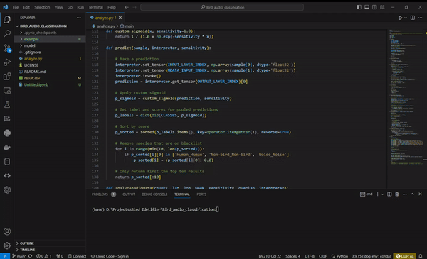

# Overview

BirdNET is an audio classification system designed for identifying bird species based on their vocalizations. Leveraging advanced machine learning techniques, BirdNET can analyze audio recordings of bird sounds and provide accurate species identification. The system supports a wide range of bird species, making it a valuable tool for birdwatchers, researchers, and anyone interested in avian biodiversity.

1. **Audio Analysis:** BirdNET utilizes cutting-edge algorithms to analyze audio recordings and extract relevant features for bird species identification.

2. **Command Line Interface:** The application is accessible via the command line, allowing users to input audio files and specify parameters for analysis.

3. **Location and Time Data:** BirdNET can take into account the recording location (latitude and longitude) and the time of recording (week of the year) to enhance accuracy.

4. **Custom Species List:** Users can provide a custom list of species for targeted analysis, making BirdNET flexible for specific birdwatching needs.

5. **Confidence Thresholds:** The system outputs raw prediction scores, and users can set confidence thresholds to filter results based on their desired level of certainty.

# Use Case
Imagine a scenario where a birdwatcher is exploring a new location with diverse bird species. The birdwatcher records an audio clip of bird songs during the early morning and wants to identify the various bird species present in that area.

**Use Case Steps:**

1. **Recording:** The birdwatcher captures a few minutes of bird sounds using a recording device.

2. **Analysis with BirdNET:**

    - The birdwatcher runs the BirdNET application via the command line.
    - Inputs the recorded audio file, providing optional parameters such as location (latitude and longitude) and       recording time (week of the year).
    - Adjusts sensitivity, overlap, and confidence thresholds based on personal preferences.

3. **Identification Results:**

    - BirdNET processes the audio file and generates a result file in CSV format.
    - The file includes identified bird species along with raw confidence scores.

4. **Review and Enjoyment:**

    - The birdwatcher reviews the results, focusing on species with high confidence scores.
    - With an 88% accuracy rate and support for over 6000 bird species, BirdNET provides reliable identification.

5. **Documentation and Collaboration:**

    - Results can be documented for personal records or shared with other birdwatchers and researchers.
    - Users can collaborate, share custom species lists, and contribute to the improvement of the BirdNET database.

# Quick Demo



# Usage

You can run BirdNET via the command line. You can add a few parameters that affect the output.

The input parameters include:

```
--i, Path to input file.
--o, Path to output file. Defaults to result.csv.
--lat, Recording location latitude. Set -1 to ignore.
--lon, Recording location longitude. Set -1 to ignore.
--week, Week of the year when the recording was made. Values in [1, 48] (4 weeks per month). Set -1 to ignore.
--overlap, Overlap in seconds between extracted spectrograms. Values in [0.0, 2.9]. Defaults tp 0.0.
--sensitivity, Detection sensitivity; Higher values result in higher sensitivity. Values in [0.5, 1.5]. Defaults to 1.0.
--min_conf, Minimum confidence threshold. Values in [0.01, 0.99]. Defaults to 0.1.
--custom_list, Path to text file containing a list of species. Not used if not provided.
```

Note: A custom species list needs to contain one species label per line. Take a look at the `model/label.txt` for the correct species label. Only labels from this text file are valid. You can find an example of a valid custom list in the 'example' folder.

Here are two example commands to run this BirdNET version:

```

python analyze.py --i "example\american-goldfinch-songs-7am-180718-62312.mp3" --lat 35.4244 --lon -120.7463 --week 18

python analyze.py --i "example\american-goldfinch-songs-7am-180718-62312.mp3" --lat 47.6766 --lon -122.294 --week 11 --overlap 1.5 --min_conf 0.25 --sensitivity 1.25 --custom_list 'example/custom_species_list.txt'

```

Note: Please make sure to provide lat, lon, and week. BirdNET will work without these values, but the results might be less reliable.

The results of the anlysis will be stored in a result file in CSV format. All confidence values are raw prediction scores and should be post-processed to eliminate occasional false-positive results.

# Contact us

Please don't hesitate to contact us if you have any issues with the code or if you have any other remarks or questions.

We are always open for a collaboration with you.

